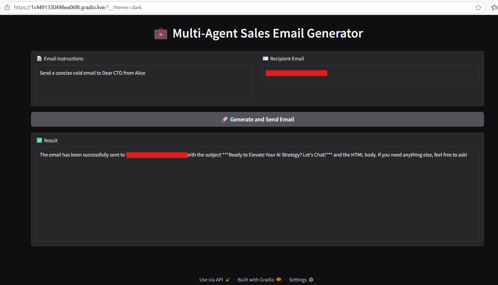

# 💼 Multi-Agent Sales Email Generator using OpenAI Agents SDK

This project uses the **OpenAI Agents SDK** to build a multi-agent, tool-using system that generates, formats, and sends sales emails

It generates sales emails with professional, witty, or concise tone, formats them in HTML, and sends them via SendGrid — all from a simple Gradio UI.


---

## 🧠 Key Features

- 🤖 **Multi-agent orchestration** (Sales Manager + Email Manager)
- 🧰 **Tool use and handoffs** between agents
- 🧾 **Structured output validation** with `pydantic`
- 🛡️ **Input and output guardrails** (profanity + tone matching)
- 📬 **Email delivery** via SendGrid
- 🧑‍💻 **Interactive Gradio UI**


⚠️ **Note:** This project is designed to run *mainly* on **Google Colab**. 

---

## 🖼️ Gradio Interface Preview




---

## 🚀 Run on Google Colab

You can try the full app instantly in your browser using Google Colab:

[](https://colab.research.google.com/drive/1eSyrRZ9Ny_aBKIByeRPd1GAVrGkx3wiX?usp=sharing)

---

## 🧠 System Architecture Overview


#### 🎛️ Sales Manager Agent

- Acts as the central controller of the workflow.
- Uses 3 sales agents as tools:
  - `sales_agent1` – DeepSeek (professional tone)
  - `sales_agent2` – Gemini (witty tone, structured output)
  - `sales_agent3` – Groq (concise tone)
- Applies guardrails:
  - ✅ **Profanity Check** – Blocks inappropriate input.
  - ✅ **Tone Check** – Ensures email matches the intended tone.
- Selects the best generated email and hands it off to the Email Manager.


#### 📬 Email Manager Agent

- Formats and sends the selected email using the following tools:
  - `subject_writer` → generates an attention-grabbing subject line.
  - `html_converter` → converts the plain text body into HTML.
  - `send_html_email` → sends the email to the provided recipient using SendGrid.

---

## 🔧 Setup Instructions

1. **Clone this repo**  
   ```bash
   git clone https://github.com/vasiliskou/multi-agent-sales-email-generator.git
   cd multi-agent-sales-email-generator
